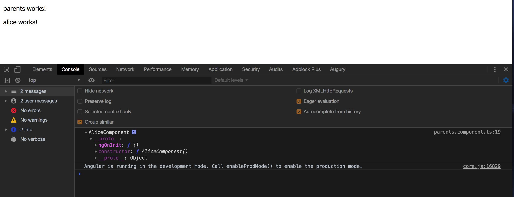

# 高级Web技术 Lab 2：Angular 框架


# 前言

这篇 Lab 主要包括了 Angular 框架的背景、技术栈和起步指导。具体学习 Angular 推荐同学们参考官方文档，不要依赖于 Lab 文档。


## 1. Angular

在PJ中，推荐同学们使用 Angular 、 React 或者 Vue 开发。不希望不使用前端框架而只使用 jQuery 等简单的库。

> Angular 官网：https://angular.io，Angular 为 Google 出品，请自备翻墙网络。

### 1.1 安装 Node 与 npm

首先，我们需要安装 [Node.js](https://nodejs.org/zh-cn/) 和 [npm](https://www.npmjs.com/)。

For Windows: 安装Lab目录中的 node-v6.10.2-x64.msi，或前往官网下载安装。

For Mac: 安装Lab目录中的 node-v6.10.2.pkg，或前往官网下载安装。

npm 会随着 Node.js 一同安装。

#### 1.1.1 Node.js

Node.js 是一个基于 Chrome V8 引擎的 JavaScript 运行时，可以近似理解为脱离浏览器运行 JavaScript 代码的平台。常见用途是开发后端服务器，同学们可以在 PJ 中使用 Node.js 开发后端。

在 Angular 板块中我们不需要用到 Node，我们需要用到的是 Node 的包管理工具 npm。

#### 1.1.2 npm

npm = Node Package Manager，绝大部分的现代前端项目中都使用 npm 作为包管理工具。在 lab1 中我们就会使用npm来安装Angular，TypeScript等包依赖。

> （重要）原生 npm 在中国的访问速度特别慢，如果没有稳定的翻墙环境，推荐使用阿里的国内 npm 镜像：https://npm.taobao.org/


### 1.2 新建 Angular 项目

> 新建 Angular 项目会用 npm 安装许多依赖，使用教学楼网络可能会消耗很长时间来下载所有文件。
>
> 如果没有翻墙网络，务必使用阿里的国内 npm 镜像，否则有很大可能下载失败。
>
> 同学们也可以通过 Angular 的 CLI 来创建新的项目，具体参考官方文档。

#### Step 1: Clone official quickstart seed

从头新建 Angular 项目是非常繁琐的，我们直接从 GitHub 上 clone Angular 的起始项目种子。在命令行中运行：

```shell
git clone https://github.com/angular/quickstart.git angular
```

#### Step 2: 使用 npm 安装依赖

首先切换到项目目录：

```shell
cd angular
```

你可以从 `package.json` 文件中查看到项目所用的依赖包。

使用 npm 安装依赖：

```shell
npm install
```

可以观察到， 在安装依赖之前，项目只有 1.4 MB。安装完依赖后，项目大小增加到了 100 MB 以上。

#### Step 3: 运行 Angular 项目

运行 Angular 项目本身是非常复杂的，不过我们 clone 的起始种子已经配置好了 Angular 的运行脚本。

```shell
# 在命令行中运行：
npm start
```

编译成功后，会在本机的 3000 端口运行一个 Node.js 后端部署我们的 Angular 项目。在浏览器中访问 localhost:3000 即可。

#### Step 4: 使用 npm 添加 Material UI 库

> Material UI 是 Google 推出的一套 UI 设计方案，提供了许多 UI 组件，类似于像 BootStrap 之类的 CSS 库。
>
> 使用 UI 库可以简单方便地编写界面美观的前端项目，大大优于手写 CSS。
>
> 这部分的目的是告诉同学们如何通过npm添加自定义的库，可以跳过。
>
> 参考网址：https://material.angular.io/

```shell
npm install --save @angular/material
npm install --save @angular/animations
```

安装之后，我们可以注意到 package.json 中多了两行：

```
......
  "@angular/animations": "^4.0.2",
......
  "@angular/material": "^2.0.0-beta.3",
......
```

新添加的库已经被记录到`package.json`中。

我们还需要在 `src/systemjs.config.js` 中的 angular bundles 里添加以下四行：

```javascript
'@angular/material': 'npm:@angular/material/bundles/material.umd.js',
'@angular/animations': 'npm:@angular/animations/bundles/animations.umd.js',
'@angular/animations/browser': 'npm:@angular/animations/bundles/animations-browser.umd.js',
'@angular/platform-browser/animations': 'npm:@angular/platform-browser/bundles/platform-browser-animations.umd.js',
```


### 3. Angular 起步

#### 3.1 TypeScript

Angular 项目一般使用 TypeScript 来代替 JavaScript。直接写 JavaScript 是合法的，但是不推荐。

TypeScript 是一种编译到 JavaScript 的编程语言，弥补了一些 JavaScript 语言上的一些缺点，比 JavaScript 更加强大好用。

> TypeScript 学习：https://www.typescriptlang.org/index.html

#### 3.2 Angular 代码结构

我们 clone 的 quickstart seed 中有许多文件，其中大部分在我们 Lab 中不需要关注。

首先我们来看 `src/index.html` ，这是 Angular 项目的起始 HTML 页面，也是唯一的 HTML 页面。我们其他的 HTML、CSS、TypeScript 等代码都会被动态加载到这个 HTML 文件中。在页面切换的时候，Angular 不会跳转到另外一个页面，而是修改这个页面。这样的设计结构也被叫做单页面应用（[Single-page application](https://en.wikipedia.org/wiki/Single-page_application)， SPA），大部分现代前端框架都采用了这种设计。

尽管网页内容都会被加载到 `src/index.html` 中，但一般我们不需要对这个文件作修改，网页内容都会动态地加载进来：

```html
<script>
	System.import('main.js').catch(function(err){ console.error(err); });
</script>
```

在这里，`index.html` 导入了 `main.js` 。`main.js` 是从 `main.ts` 编译过来的，如果你已经成功运行过 `npm start`，就能看到 `main.js` 文件。

`main.ts` 做了两件事，一是指定我们的运行平台是浏览器（Angular 还支持其他平台），二是导入了 `src/app/app.module` 文件。而 `src/app/app.module` 导入了 `src/app/app.component.ts` 文件。

我们这次的 Lab 就从`src/app/app.module` 和  `src/app/app.component.ts` 文件开始，暂时不需要理会之前的几个文件。

#### 3.3 理解起始工程

下面让我们来理解一下工程的起始页面是如何工作的。

`src/app/app.module` 的主要作用是导入需要用到的库（如 BrowserModule），并声明项目中包含的组件（如 AppComponent）。

`src/app/app.component.ts` 中的内容就是我们运行项目之后看到的 `Hello Angular`。

其中，`template` 的值 `<h1>Hello {{name}}.</h1>` 就是页面上的`Hello Angular`。

`name` 变量在 `AppComponent` 类中被定义为了 `‘Angular’` ，修改 `name` 变量的值就可以修改对应的 HTML 代码，这个特性被称为`数据绑定`。

`selector: 'my-app'` 对应的是 `index.html` 中的`<my-app></my-app>`，表示当前组件的代码会被插入到 `<my-app>` 标签中。

页面的 CSS 效果是因为 `index.html` 中链接了 `style.css` ，像这样直接配置全局 CSS 在 Angular 中不是一个好的方式，后面会介绍应当如何在 Angular 工程中写 CSS 代码。

#### 3.4 修改起始代码，改成计时器

首先，我们导入刚刚安装的 `Material UI` 组件到 `src/app/app.module` 中：

```typescript
import {NgModule}      from '@angular/core';
import {BrowserModule} from '@angular/platform-browser';
import {BrowserAnimationsModule} from '@angular/platform-browser/animations';
import {MdButtonModule} from '@angular/material';

import {AppComponent}  from './app.component';

@NgModule({
  imports: [BrowserModule, MdButtonModule, BrowserAnimationsModule],
  exports: [MdButtonModule],
  declarations: [AppComponent],
  bootstrap: [AppComponent]
})
export class AppModule {
}
```

这里只导入了 `Material UI` 中的 `MdButtonModule`， 即按钮组件的样式。使用组件则需要导入对应的组件模块。

然后修改 `src/app/app.component.ts` 为：

```typescript
import {Component} from '@angular/core';

@Component({
  selector: 'my-app',
  styles: ['h1 {color: #00bcd4;}', 'button {background-color: #00bcd4; color: white}'],
  template: `<h1>Time flows: {{time}}s.</h1>
			 <button md-raised-button (click)="addOneSecond()">+1s</button>`,
})
export class AppComponent {
  time = 0;

  ngOnInit():void {
    let self = this;
    setInterval(function () {
      self.time += 1;
    }, 1000);
  }

  addOneSecond():void {
    this.time += 1;
  }
}
```

 `src/app/app.component.ts` 中目前包含了整个页面的 HTML，CSS 和 TypeScript 代码。

- styles 数组即为当前页面的 CSS 设置。
  - 这种类似内联的方式也不够好，推荐使用外联：修改这行为`styleUrls: ['./app.component.css']`，并将 CSS 代码写在 `app.component.css` 文件中。
  - 在 Component 内的 CSS 代码是局部的，不是全局的，不同 Component 中的 CSS 不会相互影响。不仅如此，你甚至可以在不同 Component 中定义 id 或 class 相同的元素，它们的 CSS 也不会相互影响。
- template 中是页面的 HTML 代码
  - {{time}} 对应 AppComponent 中的 time 变量
  - `md-raised-button` 是 Material UI 里的一种按钮样式（md = material design）
  - `(click)="addOneSecond()"` 表示按钮点击时调用 AppComponent 中的 addOneSecond 方法
  - 与 CSS 相同，将此行改为 `templateUrl: 'app.component.html'` 即可使用外联的方式写 HTML 代码
- AppComponent 中定义了一个 time 变量。
  - ngOnInit 方法会在 AppComponent 首次被加载时调用，里面代码的作用是每秒给 time 变量加一
  - addOneSecond 方法可以直接为 time 变量加一

运行后界面如图： 

同学们可以在此基础上自己尝试做些修改。


## 4. 进阶部分

### 4.1 背景知识

从父子组件之间的关系谈起。

#### 4.1.1 Angular的“ng-”元素

Angular拥有很多遵循```ng-```命名约定的属性，它们都共享一个共同的特征（它们不会被渲染到最终的DOM中），但是在行为和用法上有所不同。

1. ```<ng-container>```

我们一般用的最多的那个是ng-container。Angular 的```<ng-container>``是一个分组元素，但它不会污染样式或元素布局，因为 Angular压根不会把它放进 DOM中。

2. ```<ng-content>```

将HTML注入到指定位置的模板中的能力，这现在被称为 “内容投影”。在这种情况下，```<ng-content>``` 元素完全被投影内容所取代。

3. ```<ng-template>```

```<ng-template>```是一个 Angular 元素，用来渲染 HTML。 它永远不会直接显示出来。 事实上，在渲染视图之前，Angular 会把 ```<ng-template>``` 及其内容替换为一个注释。

如果没有使用结构型指令（例如```*ngIf```和```*ngFor```），而仅仅把一些别的元素包装进 ```<ng-template>``` 中，那些元素就是不可见的。

```<ng-content>``` 主要是内容投射功能的基础，非常有用；```<ng-template>``` 可以动态创建模板；```<ng-container>``` 主要在条件判断时不引入额外的 DOM 元素。

### 4.2 实验步骤

#### 4.2.1 父子组件关系（Part1）

在终端命令行输入如下的命令 :

```ini
# 创建新的项目，项目名称 lab2-angular-code-part1
ng new lab2-Angulae-code-part1
# 遇到界面提示‘Y/N’，直接按回车即可
# 进入文件夹
cd lab2-Angulae-code-part1
# 创建parents组件
ng generate component parents
# 创建Alice组件
ng generate component alice
# 创建Bob组件
ng generate component bob
# 创建Tom组件
ng generate component tom
```
> 假设parents(父母)有孩子的名称为Alice、Bob和Tom

在项目的```lab2-angular-code-part1/src/app/app.component.html```，首先清空这个模版页面的内容，然后输入如下的代码:

```html
<app-parents>
  <app-alice></app-alice>
  <app-bob></app-bob>
</app-parents>
```

这个时候去访问```http://localhost:4200```，你会发现只会输出如下的界面内容

```html
parents works!
```

##### (1) ```<ng-content>```

你会发现，alice和bob组件内部的内容都不会在页面上输出的。如果想要输出alice和bob组件内部的内容，就要在```src/app/parents/parents.component.html```,加入```<ng-content>```闭合标签，模版的代码如下所示:

```html
<p>
  parents works!
</p>
<ng-content></ng-content>
```

这个时候再访问首页，你会发现浏览器上输出了三个组件的模板内容:

```html
parents works!

alice works!

bob works!
```

如果你想控制选择性的让alice或者bob输出，那么```<ng-content>```还有```select```属性，可以选择控制其中一种输出:
```src/app/parents/parents.component.html```

代码修改如下:

```html
parents work！
<ng-content select="app-alice"></ng-content>
```

在浏览器上的输出结果如下:

```html
parents works!

alice works!
```

##### (2) ContentChild

如果在

```html
<parents-component>
    <alice-component></alice-component>
    <bob-component></bob-component>
</parents-component>
```

这个组件调用结果，parents组件可以通过ContentChild去访问得到alice组件内部的内容。
src/app/parents/parents.component.ts，修改代码为如下:

```javascript
import { Component, OnInit, ContentChild } from '@angular/core';
import {AliceComponent} from '../alice/alice.component';

@Component({
  selector: 'app-parents',
  templateUrl: './parents.component.html',
  styleUrls: ['./parents.component.css']
})
export class ParentsComponent implements OnInit {

  @ContentChild(AliceComponent) alice:AliceComponent;
  
  constructor() { }

  ngOnInit() {
  }

  ngAfterContentInit() {
    console.log(this.alice);
  } 

}

```

在浏览器的控制台打印出来的界面如下所示:



可以看到是打印 AliceComponent组件内的全部的变量和方法的，我们实际上没有定义，所以看到的内容比较少。

> 实际上，到了这里这种组件的定义并不是父子组件的关系。

下面开始介绍父子组件的形式；

##### (3) 父子组件

将```lab2-angular-code-part1/src/app/app.component.html```的代码修改如下:

```html
<app-parents></app-parents>
```

在```src/app/parents/parents.component.html```的代码修改如下:

```html
<p>
parents work！
</p>
<app-alice></app-alice>
```
在ParentsComponent组件的模板中引入的标签```<app-alice></app-alice>```，这样ParentsComponent和AliceComponent才构成父子组件的关系。

这个时候在浏览上的输出结果为:

```html
parents works!

alice works!
```

##### (4) ViewChild 装饰器

如果父亲组件想访问子组件内部的属性和方法，用的是ViewChild 装饰器，

这个组件调用结果，parents组件可以通过ViewChild去访问得到alice组件内部的方法和属性。
```src/app/parents/parents.component.ts```，修改代码为如下:

```javascript
import { Component, OnInit, ContentChild } from '@angular/core';
import {AliceComponent} from '../alice/alice.component';

@Component({
  selector: 'app-parents',
  templateUrl: './parents.component.html',
  styleUrls: ['./parents.component.css']
})
export class ParentsComponent implements OnInit {

  @ViewChild(AliceComponent) alice:AliceComponent;
  
  constructor() { }

  ngOnInit() {
  }

  ngAfterContentInit() {
    console.log(this.alice);
  } 

}

```

这个时候在浏览器上的输出结果是 ：


与上面的第一张图的输出结果是一样的。


##### (5) ```<ng-template>```

在```src/app/parents/parents.component.html```的代码修改如下 :

```html
<p>
parents work！
</p>
<app-alice></app-alice>
<app-bob></app-bob>
<app-tom></app-tom>
```

在浏览器上的输出结果是:

```html
parents work！

alice works!

bob works!

tom works!
```

实际上，我们发现，alice，bob，tom三个组件的有相同的部分，都是只输出了"组件名 works!"而已。而且alice，bob，tom三个组件几乎完全相同，能否有没有模版来实现这样的操作，下面介绍```<ng-template>```。

在```src/app/parents/parents.component.html```的代码修改如下 :

```html
<p>
  parents work！
</p>
<!-- 模版的定义，实际上不会输出结果 -->
<ng-template #childTemplate let-name="name">
  <p>{{name}} works</p>
</ng-template>

<!-- 对模版赋值 -->
<div [ngTemplateOutlet]="childTemplate" 
        [ngTemplateOutletContext]="{name: 'alice'}">
</div>

<!-- 对模版赋值 -->
<div [ngTemplateOutlet]="childTemplate" 
        [ngTemplateOutletContext]="{name: 'bob'}">
</div>

<!-- 对模版赋值 -->
<div [ngTemplateOutlet]="childTemplate" 
        [ngTemplateOutletContext]="{name: 'tom'}">
</div>
```

可以看到浏览器上输出的结果是 ：

```html
parents work！

alice works

bob works

tom works
```

说明 : 在```<div></div>```标签内部定义的方括号扩起来的，如ngTemplateOutlet、ngTemplateOutletContext一般称之为指令。

好的，到这里，我们定义了三个组件，完成的工作都是输出结果，有高度的一致性，我们能不能只定义一个组件 Children 组件，然后利用这个组件去实现三个组件的创建，类似于工厂方法的设计模式呢？

#### 4.2.2 动态组件(Dynamic Component)（Part2）

动态组件的代码可能在最终的 PJ 上是用不到的，这里供拓展相关的知识。

首先，到了这里，要将之前的三个孩子组件全部删除，可以还要考虑删除引用的问题。我在这里是重新新建项目，再创建两个组件简单点，如下操作:

```ini
# 创建新的项目，项目名称 lab2-angular-code-part2
ng new lab2-Angulae-code-part2
# 遇到界面提示‘Y/N’，直接按回车即可
# 进入文件夹
cd lab2-Angulae-code-part2
# 创建parents组件
ng generate component parents
# 创建children组件
ng generate component children
```

Children组件是允许外部的值输入，这样简单点。

在```lab2-angular-code-part2/src/app/children/children.component.html```的代码修改如下 :

```html
<p>
{{name}} works!
<p>
```

在```lab2-angular-code-part2/src/app/children/children.component.ts```的代码修改如下 :

```javascript
import { Component, OnInit, Input } from '@angular/core';

@Component({
  selector: 'app-children',
  templateUrl: './children.component.html',
  styleUrls: ['./children.component.css']
})
export class ChildrenComponent implements OnInit {

  // 组件name值允许外部输入
  @Input() name:string;

  constructor() { }

  ngOnInit() {
  }

}
```


在``````lab2-angular-code-part2/src/app/parents/parents.component.html```的代码修改如下:

```html
<p>
  parents works!
</p>
<ng-template #addChild></ng-template>
<button (click)="createComponent('alice');">add alice</button>
<button (click)="createComponent('bob');">add bob</button>
<button (click)="createComponent('tom');">add tom</button>

```

在```lab2-angular-code-part2/src/app/parents/parents.component.ts```的代码修改如下:

```javascript
import { Component, OnInit, ComponentFactory,ViewContainerRef,ViewChild, OnDestroy,ComponentFactoryResolver, TemplateRef } from '@angular/core';
import { ChildrenComponent } from '../children/children.component';
import { ComponentRef } from '@angular/core';

@Component({
  selector: 'app-parents',
  templateUrl: './parents.component.html',
  styleUrls: ['./parents.component.css']
})
export class ParentsComponent implements OnInit, OnDestroy {

  // Children组件的引用
  componentRef: ComponentRef<ChildrenComponent>;

  // 通过 ViewChild 装饰器来获取视图中的模板元素，如果没有指定第二个查询参数read，则默认返回的组件实例或相应的 DOM 元素，但是在这里我们需要获取 ViewContainerRef 实例。
  @ViewChild("addChild", { read: ViewContainerRef }) addChild: ViewContainerRef;

  // 在我们定义 createComponent() 方法前，我们需要注入 ComponentFactoryResolver 服务对象。该 ComponentFactoryResolver 服务对象中，提供了一个很重要的方法 - resolveComponentFactory() ，该方法接收一个组件类作为参数，并返回 ComponentFactory
  constructor(private componentFactoryResolver: ComponentFactoryResolver) { }

  ngOnInit() {

  }

  createComponent(name: string) {

    // 每次我们需要创建组件时，我们需要删除之前的视图，否则组件容器中会出现多个视图 (如果允许多个组件的话，就不需要执行清除操作 )。
    this.addChild.clear();
    // resolveComponentFactory() 方法接受一个组件并返回如何创建组件的 ComponentFactory 实例
    let componentFactory : ComponentFactory<ChildrenComponent>= this.componentFactoryResolver.resolveComponentFactory(ChildrenComponent);

    console.log(componentFactory); 
    // 创建组件引用
    this.componentRef= this.addChild.createComponent(componentFactory);
    // 已经能获取新组件的引用，即可以我们可以设置组件的输入类型
    this.componentRef.instance.name=name;
    console.log(this.componentRef);


  }
  ngAfterViewInit() {
    console.log(this.addChild);
  }

  ngOnDestroy() {

  }
}

```


最后，在app.module.ts文件加入引入部分的代码，如下所示：

```javascript
import { BrowserModule } from '@angular/platform-browser';
import { NgModule } from '@angular/core';

import { AppComponent } from './app.component';
import { ParentsComponent } from './parents/parents.component';
import { ChildrenComponent } from './children/children.component';

@NgModule({
  declarations: [
    AppComponent,
    ParentsComponent,
    ChildrenComponent,
  ],
  imports: [
    BrowserModule
  ],
  providers: [],
  // 将动态组件ChildrenComponent添加到 NgModule 的entryComponents 属性中
  entryComponents:[ChildrenComponent],
  bootstrap: [AppComponent],
})
export class AppModule { }

```

最终的界面如下，可以实现点击按钮即可创建相应的组件。


## 5. 继续学习 Angular

到这里，Lab 文档已经介绍了许多 Angular 相关的知识，但是没有讲的知识更多，无法一一讲解。

继续学习 Angular 请阅读官方 Tutorial。

相关参考：

> Angular 官方网站: https://angular.io，中文网站：https://angular.cn。推荐先阅读文档中的 Tutorial 部分实现官方样例，再阅读 Guide 部分详细了解 Angular 的工作原理。
>
> Angular 开发相关资源：https://angular.io/resources，中文：https://angular.cn/resources。其中，IDE 推荐使用 IntelliJ 或者 WebStorm，Tooling 部分推荐学习 Angular CLI，UI Component 部分列举了目前主要的 UI 库，跨平台开发部分推荐了解 Ionic 和 Electron。
>
> TypeScript: https://www.typescriptlang.org/index.html
>
> npm: https://docs.npmjs.com/getting-started
>
> china npm: https://npm.taobao.org/
>
> Node.js: https://nodejs.org

## 6. 课后作业

作业的上交时间会在超星学习通上面通知的。

**题目1:** 

- 在第一部分，给alice组件定义属性值```age=13```,方法值```sayHello() {console.log("alice say hello")}```，然后利用ContentChild()在父组件中调用子组件内的方法。这部分代码以“姓名+学号+angular+part1.zip”的压缩，(node_modules文件夹不包括)

- 在第二部部分，子组件有一个```input```的属性，输入了姓名```name```字段值。现在要求以合理的方式实现父子组件通信的功能，功能上不要求。这部分代码以“姓名+学号+angular+part2.zip”的压缩，(node_modules文件夹不包括)

**题目2:**

在最终的 PJ 中，MyBaitis 或者 Hibernate 都可以称之为 ORM 框架， Spring MVC 可以实现 MVC 框架，Angular 、Vue 是 MVVM 框架，前后端分离的 Restful API 是简单的微服务架构。请试着解释 ORM、MVC、MVVM、微服务架构 之间的概念，并分析一些优缺点。

**题目3:**

同学们在 Web 应用基础课上学习的 jQuery 在七年之前还是相当前沿的 JavaScript 库；而如今，jQuery 慢慢淡出舞台，Angular, React 和 Vue 是三个最流行的前端框架。传统的 JavaScript 库以 DOM 操作为核心，现在流行的 MVVM 前端框架以少操作 DOM 和以数据核心操作对象。谈谈前端这种编程方式衍变的好处来加深对于 MVVM 框架的理解？


